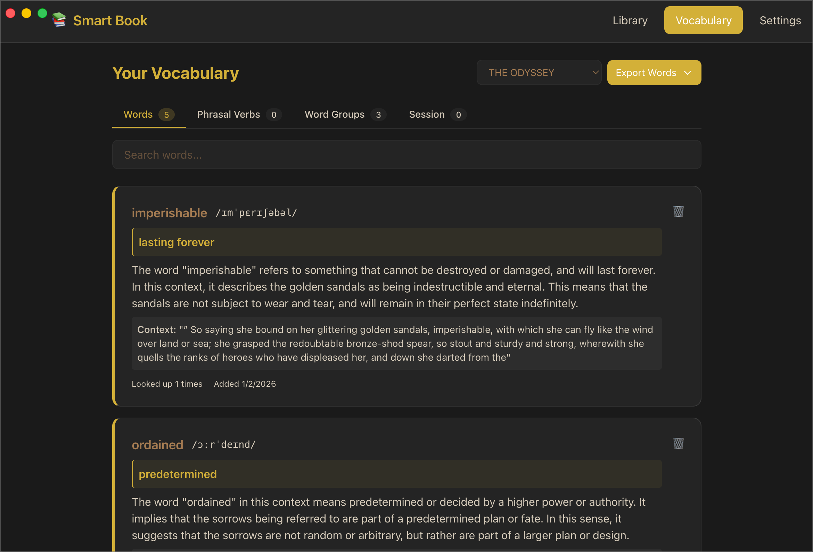

# Smart Book Reader


A smart book reader application with dynamic text wrapping, AI-powered word lookup, offline pronunciation audio, and vocabulary tracking.

## Features

- **Dynamic Text Wrapping**: Automatic text reflow and hyphenation for optimal reading.
- **AI Word Lookup**: Instant definitions, translations, and word context using Groq API.
- **Offline Pronunciation**: Neural text-to-speech in English, German, and Russian (no internet required).
- **Vocabulary Tracking**: Track learned words and build your vocabulary.
- **Multi-Format Support**: EPUB, PDF, and text files.
- **Adaptive Themes**: Multiple reading themes with automatic adjustment.

## Screenshots

<div align="center">

### Reading Experience


*Immersive full-screen reading mode with clean typography*

---

### AI-Powered Word Lookup

<div style="display: flex; gap: 10px; justify-content: center;">
  
  
</div>

*Instant word definitions and context analysis*

---

### Smart Side Panel Features

<div style="display: flex; gap: 10px; justify-content: center;">
  
  
</div>

*Pronunciation, IPA transcription, and grammar insights*

---

### Vocabulary Tracking


*Build and track your vocabulary over time*

</div>

---

## 📋 Governance & Security

This project follows professional open-source standards to ensure user safety and build integrity:

* **Code Signing**: Application submitted to [SignPath Foundation](https://signpath.org/) for free code signing certificate. Awaiting approval. See our [Code Signing Policy](CODESIGNING.md) for details.
* **Privacy**: Your reading data stays on your device. Read our [Privacy Policy](PRIVACY.md) regarding local storage and optional AI lookups.
* **Licensing**: All third-party components and their licenses are documented in [THIRD_PARTY_NOTICES.md](THIRD_PARTY_NOTICES.md).
* **Community**: We are committed to a welcoming environment. Please review our [Code of Conduct](CODE_OF_CONDUCT.md).

---

## Prerequisites

- **Node.js** 18 or higher
- **Python** 3.9 or higher
- **npm** or **yarn**

## Quick Start

### 1. Clone and Install

```bash
git clone https://github.com/mahmutsalman/book-reader.git
cd book-reader
npm install
```

### 2. Python Server Setup

The app includes an offline pronunciation server that requires voice models:

```bash
npm run python:setup
```

This will:

- Create a Python virtual environment
- Install Python dependencies
- Prompt you to download voice models (~180MB for all 3 languages)

> **Note**: Voice models are optional but required for pronunciation features. The app works without them, but pronunciation buttons will be disabled.

### 3. Run the App

```bash
npm start
```

---

## Development

### Project Structure

```
BookReader/
├── src/
│   ├── main/             # Electron main process
│   ├── renderer/         # React frontend
│   ├── python-server/    # Python pronunciation server
│   │   ├── server.py     # FastAPI server
│   │   ├── generators/   # TTS and IPA generators
│   │   ├── models/       # Piper TTS voice models (downloaded separately)
│   │   └── build.sh      # Python server build script
│   └── shared/           # Shared TypeScript types
├── package.json
└── README.md
```

### Available Scripts

```bash
# Development
npm start                  # Start in development mode
npm run lint               # Run ESLint

# Python Server
npm run python:setup       # Setup Python environment (dev mode)
npm run python:build       # Build production binary (macOS/Linux)
npm run python:build:win   # Build production binary (Windows)

# Production
npm run package            # Package app for current platform
npm run make               # Create distributable packages
```

### Voice Models

The app uses Piper TTS for offline pronunciation. Voice models are downloaded from HuggingFace.

**Included Languages:**

| Language | Voice | Size | License | Source |
|----------|-------|------|---------|--------|
| English (US) | Lessac | ~60MB | MIT | [HuggingFace](https://huggingface.co/rhasspy/piper-voices) |
| German | Thorsten | ~60MB | MIT | [HuggingFace](https://huggingface.co/rhasspy/piper-voices) |
| Russian | Dmitri | ~60MB | MIT | [HuggingFace](https://huggingface.co/rhasspy/piper-voices) |

**Attribution:** Voice models are part of the [Piper TTS](https://github.com/rhasspy/piper) open-source project by Rhasspy. See [THIRD_PARTY_NOTICES.md](THIRD_PARTY_NOTICES.md) for complete licensing information.

---

## Building for Production

### macOS/Linux

```bash
npm run python:build
npm run package
npm run make
```

### Windows

```bash
npm run python:build:win
npm run package
npm run make
```

---

## Architecture

### Offline-First Design

The app is designed to work completely offline:

- ✅ Book reading and text rendering
- ✅ AI word lookup (Groq API)
- ✅ Pronunciation audio (Piper TTS)
- ✅ IPA transcription (gruut)
- ✅ Vocabulary tracking

### Tech Stack

- **Frontend**: Electron 33, React 18, TypeScript, Vite
- **Backend**: Python 3.13, FastAPI, Piper TTS (ONNX models)

---

## Contributing

Contributions are welcome! Please read our [Contributing Guidelines](CONTRIBUTING.md) before submitting a Pull Request.

1. Fork the repository
2. Create a feature branch (`git checkout -b feature/amazing-feature`)
3. Commit your changes (`git commit -m 'feat: add amazing feature'`)
4. Push to the branch (`git push origin feature/amazing-feature`)
5. Open a Pull Request

---

## License

MIT License - see [LICENSE](LICENSE) file for details.

---

## Acknowledgments

- [SignPath Foundation](https://signpath.org/) - For providing free code signing for open-source projects.
- [Piper TTS](https://github.com/rhasspy/piper) - High-quality offline neural voices by Rhasspy.
- [Groq](https://groq.com/) - Fast AI inference for word definitions and context.
- [gruut](https://github.com/rhasspy/gruut) - IPA phonetic transcription library.

---

## Support

For issues and questions:

- 🐛 [Report a bug](https://github.com/mahmutsalman/book-reader/issues/new?template=bug_report.md)
- 💡 [Request a feature](https://github.com/mahmutsalman/book-reader/issues/new?template=feature_request.md)
- 📧 Email: csmahmutsalman@gmail.com
