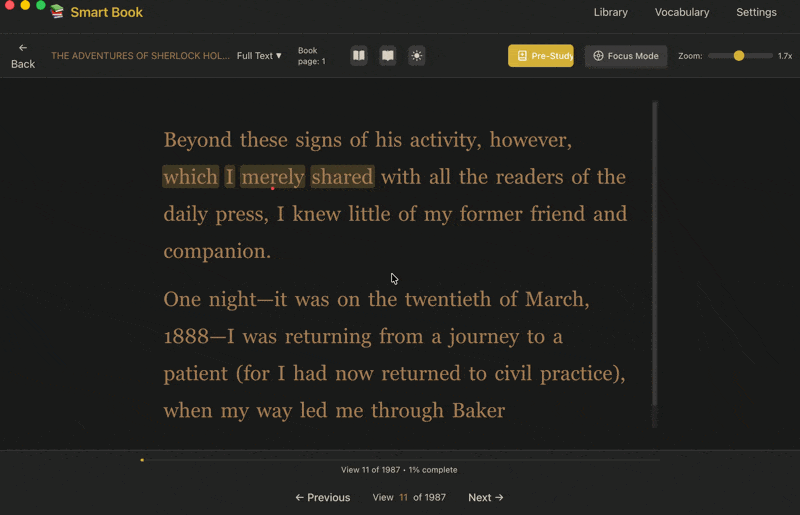
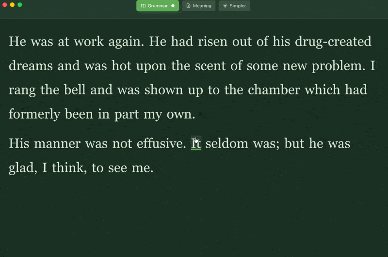
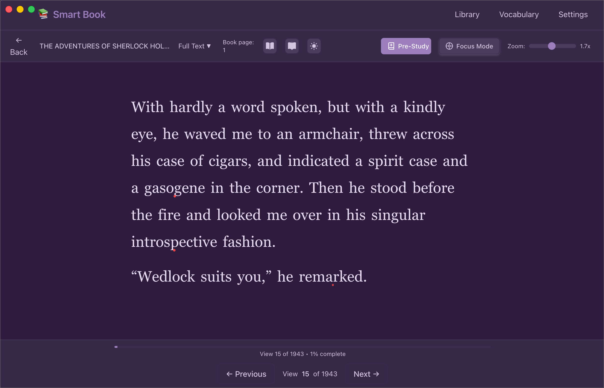
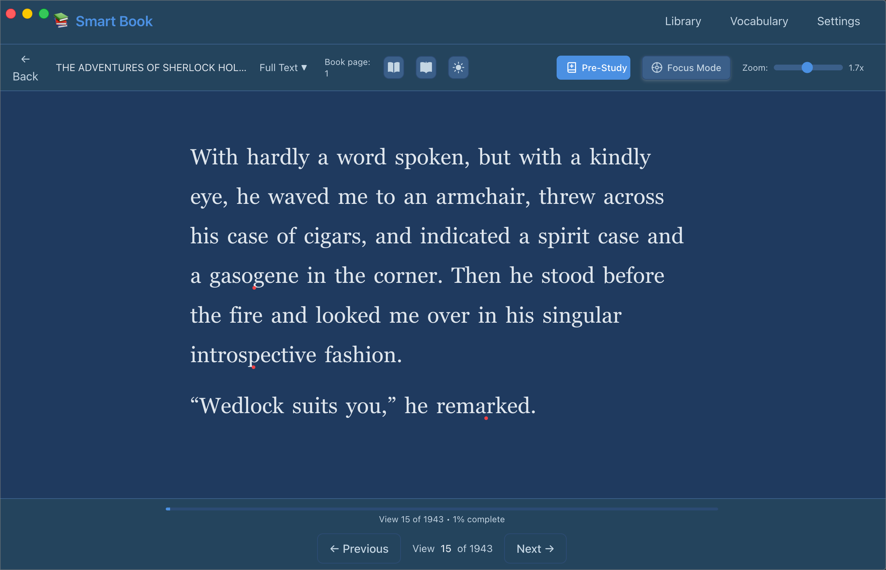
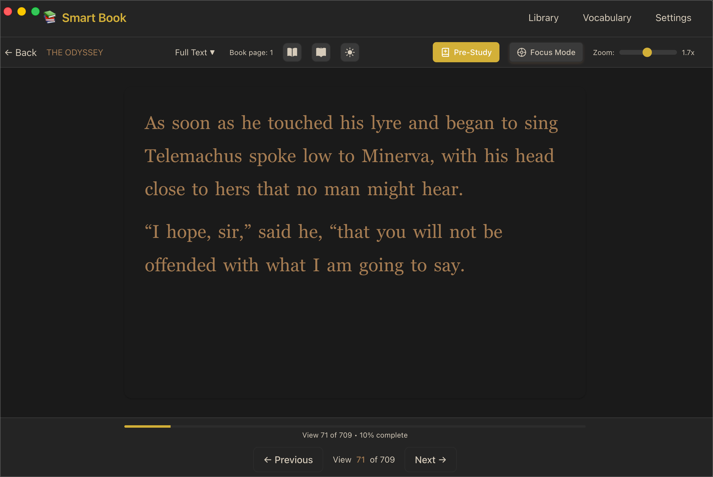
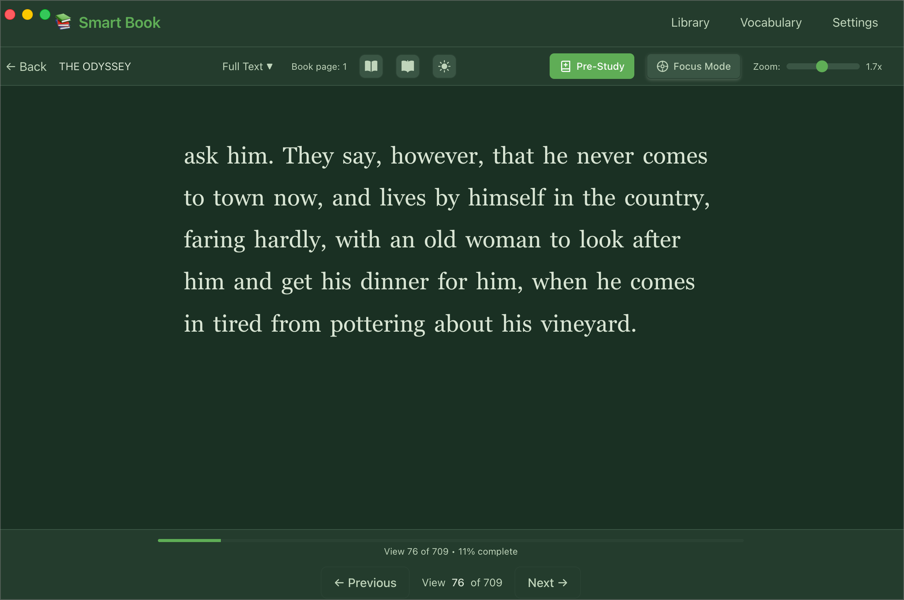
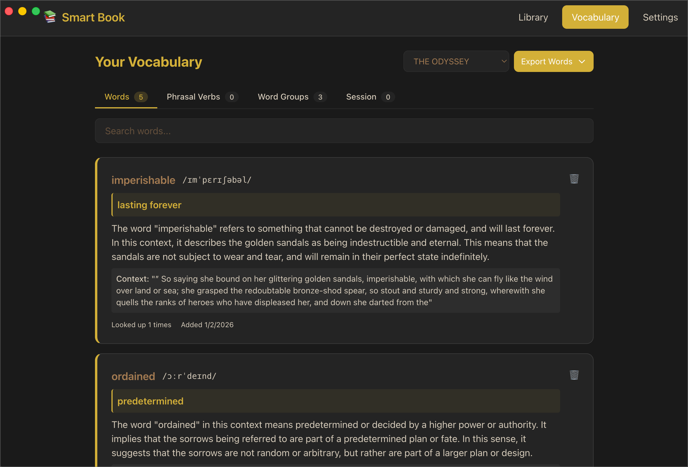
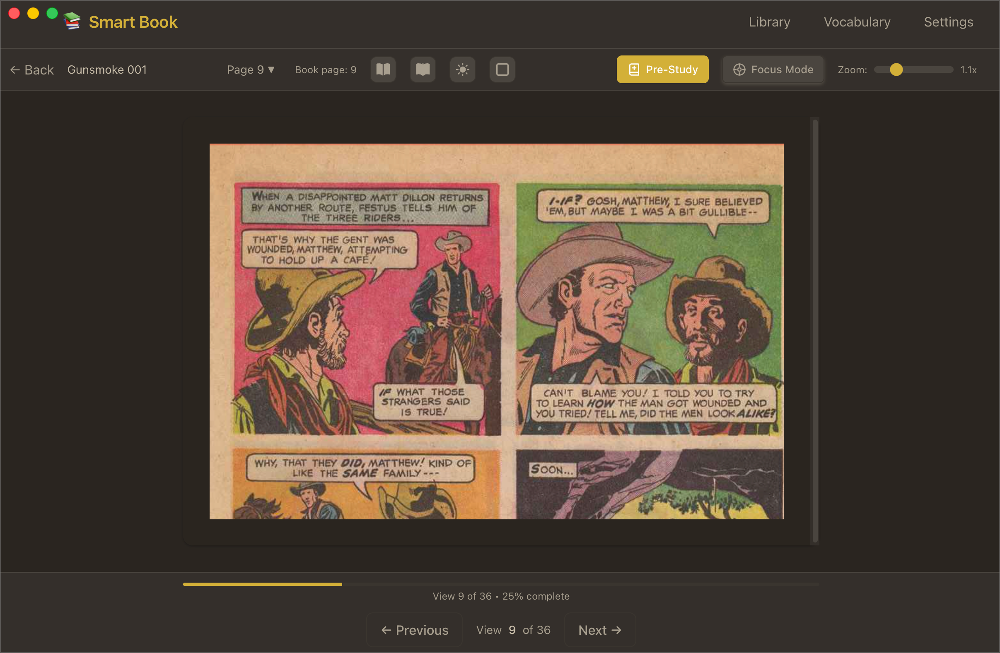

# Smart Book Reader


## About

Smart Book Reader revolutionizes the reading experience with **lightning-fast, context-aware word lookup**. Unlike traditional dictionaries that overwhelm you with dozens of irrelevant meanings, our AI analyzes the surrounding text to deliver **exactly the meaning you need** — instantly.

### Why Smart Book Reader?

**📚 Context-Aware Definitions**
Traditional dictionaries list 10+ meanings for simple words, leaving you confused about which one fits your context. Smart Book Reader uses AI to understand the sentence you're reading and provides **only the relevant definition** — no more guessing, no more confusion.

**⚡ Instant Multi-Word Lookup**
Select single words or **entire phrases** to get comprehensive context analysis. Perfect for idioms, technical terms, or complex expressions that don't make sense word-by-word.

**🌍 Multi-Language Support**
Read books in English, German, Russian, French, Spanish, Italian, Portuguese, Japanese, Chinese, or Korean — and get definitions explained in your preferred language, not just the book's language.

**🎯 Smart & Fast**
Click any word and get instant AI-powered definitions, translations, pronunciation, and grammar insights — all without leaving your reading flow.

**🔧 Advanced Technical Stack**
- **Neural Text-to-Speech**: Offline pronunciation using [Piper TTS](https://github.com/rhasspy/piper) with Microsoft-quality neural voices — no internet required
- **IPA Phonetic Transcription**: Accurate pronunciation guides generated with [gruut](https://github.com/rhasspy/gruut) linguistic toolkit
- **Multiple AI Providers**: Flexible backend supporting Google Gemini, Groq, Mistral, OpenRouter, and LM Studio (local)
- **Built-in OCR**: OnnxOCR (PP-OCRv5) bundled directly — no manual install, instant manga and comic text extraction
- **Silent Auto-Updates**: Updates install silently in the background on both Windows and macOS

---

## Features

- **Dynamic Text Wrapping**: Automatic text reflow and hyphenation for optimal reading
- **AI Word Lookup**: Instant definitions, translations, and word context using your choice of AI provider
- **Explanation Language**: Choose what language definitions are returned in — independent of the book's language
- **Offline Pronunciation**: Neural text-to-speech via Piper TTS (no internet required)
- **IPA Phonetic Transcription**: Phonetic guides for accurate pronunciation
- **Vocabulary Tracking**: Track learned words and build your vocabulary
- **Multi-Format Support**: EPUB, PDF, TXT, Manga/ZIP/CBZ/CBR, and PNG
- **Adaptive Themes**: Multiple reading themes (light, dark, purple, ocean blue, and more)
- **Comic Book & Manga OCR**: Built-in OnnxOCR for reading comics and manga — extract text from images and look up words with AI instantly, including from focus mode
- **Silent Auto-Updates**: Background updates on Windows (Squirrel) and macOS (Squirrel.Mac) with a "Restart Now" banner when ready

---

## 🎬 See It in Action

<div align="center">

### 📝 Word Selection & Multi-Word Lookup



*Select multiple words for comprehensive context analysis - Light theme*

---


*Dark theme variant with enhanced readability*

---

### 🎯 Focus Mode with Grammar Analysis


*Immersive focus mode with grammar insights for deeper language learning*

</div>

---

## Screenshots

<div align="center">

### Reading Experience


*Immersive full-screen reading mode with clean typography*

---

### Adaptive Themes


*Purple theme for comfortable reading*

---



*Ocean blue theme variant*

---

### AI-Powered Word Lookup



*Instant word definitions and context analysis - Light theme*

---



*Dark theme variant with word lookup panel*

---

### Smart Side Panel Features


*Pronunciation, IPA transcription, and grammar insights*

---


*Grammar analysis panel with detailed linguistic breakdown*

---

### Vocabulary Tracking


*Build and track your vocabulary over time*

---

### Comic Book OCR


*Read manga and comics with built-in OCR powered by OnnxOCR (PP-OCRv5)*

---


*Extract text from comics and look up words instantly with AI-powered definitions*

</div>

---

## 📋 Governance & Security

- **Code Signing**: macOS builds are notarized by Apple. Windows builds use Squirrel for auto-update delivery.
- **Privacy**: Your reading data stays on your device. Read our [Privacy Policy](PRIVACY.md) regarding local storage and optional AI lookups.
- **Licensing**: All third-party components and their licenses are documented in [THIRD_PARTY_NOTICES.md](THIRD_PARTY_NOTICES.md).
- **Community**: We are committed to a welcoming environment. Please review our [Code of Conduct](CODE_OF_CONDUCT.md).

---

## Prerequisites

- **Node.js** 18 or higher
- **Python** 3.9 or higher
- **npm** or **yarn**

## Quick Start

### 1. Clone and Install

```bash
git clone https://github.com/mahmutsalman/book-reader.git
cd book-reader
npm install
```

### 2. Python Server Setup

The app requires a Python virtual environment for the pronunciation and OCR server:

```bash
cd src/python-server
python3 -m venv venv
venv/bin/pip install -r requirements.txt
```

> **Note**: This is required for TTS, IPA, OCR, and PDF import to work in dev mode. The English voice model (~60MB) is auto-downloaded on first use.

### 3. Run the App

```bash
npm start
```

---

## Development

### Project Structure

```
BookReader/
├── src/
│   ├── main/             # Electron main process
│   ├── renderer/         # React frontend
│   ├── python-server/    # Python server (TTS, IPA, OCR, PDF)
│   │   ├── server.py     # FastAPI server
│   │   ├── generators/   # TTS and IPA generators
│   │   └── build.sh      # Python server build script
│   ├── database/         # SQLite + migrations
│   └── shared/           # Shared TypeScript types and IPC channels
├── package.json
└── README.md
```

### Available Scripts

```bash
# Development
npm start                  # Start in development mode
npm run lint               # Run ESLint

# Python Server
npm run python:setup       # Setup Python environment (dev mode)
npm run python:build       # Build production binary (macOS/Linux)
npm run python:build:win   # Build production binary (Windows)

# Production
npm run package            # Package app for current platform
npm run make               # Create distributable packages
```

### Voice Models

The app uses Piper TTS for offline pronunciation. The English voice model is auto-downloaded on first use. Additional language models can be downloaded from HuggingFace.

**Supported Languages (TTS):**

| Language | Voice | Size | License | Source |
|----------|-------|------|---------|--------|
| English (US) | Lessac | ~60MB | MIT | [HuggingFace](https://huggingface.co/rhasspy/piper-voices) |
| German | Thorsten | ~60MB | MIT | [HuggingFace](https://huggingface.co/rhasspy/piper-voices) |
| Russian | Dmitri | ~60MB | MIT | [HuggingFace](https://huggingface.co/rhasspy/piper-voices) |

**Attribution:** Voice models are part of the [Piper TTS](https://github.com/rhasspy/piper) open-source project by Rhasspy. See [THIRD_PARTY_NOTICES.md](THIRD_PARTY_NOTICES.md) for complete licensing information.

---

## Building for Production

### macOS/Linux

```bash
npm run python:build
npm run make
```

### Windows

```bash
npm run python:build:win
npm run make
```

Platform builds for distribution are handled by **GitHub Actions** — macOS on `macos-latest` (produces notarized DMG + ZIP) and Windows on `windows-latest` (produces Squirrel installer).

---

## Architecture

### Tech Stack

- **Frontend**: Electron, React 18, TypeScript, Vite
- **Backend**: Python 3.11, FastAPI, Piper TTS (ONNX), OnnxOCR (PP-OCRv5)
- **Database**: SQLite via better-sqlite3
- **AI Providers**: Google Gemini, Groq, Mistral, OpenRouter, LM Studio (local)

### Auto-Update

Silent background updates on both platforms:

| Platform | Mechanism | Behavior |
|---|---|---|
| **Windows** | Squirrel | Downloads in background, "Restart Now" banner when ready |
| **macOS** | Squirrel.Mac | Downloads in background, "Restart Now" banner when ready |

### Supported Book Formats

| Format | Notes |
|---|---|
| EPUB | Full text extraction |
| PDF | Text + image fallback via OCR |
| TXT | Plain text |
| Manga / ZIP / CBZ / CBR | Per-page OCR on demand |
| PNG | Single-page image with OCR |

---

## Contributing

Contributions are welcome! Please read our [Contributing Guidelines](CONTRIBUTING.md) before submitting a Pull Request.

1. Fork the repository
2. Create a feature branch (`git checkout -b feature/amazing-feature`)
3. Commit your changes (`git commit -m 'feat: add amazing feature'`)
4. Push to the branch (`git push origin feature/amazing-feature`)
5. Open a Pull Request

---

## License

MIT License - see [LICENSE](LICENSE) file for details.

---

## Acknowledgments

- [Piper TTS](https://github.com/rhasspy/piper) - High-quality offline neural voices by Rhasspy
- [OnnxOCR](https://github.com/jingsongliujing/OnnxOCR) - PP-OCRv5 based OCR via ONNX Runtime
- [gruut](https://github.com/rhasspy/gruut) - IPA phonetic transcription library
- [Groq](https://groq.com/) - Fast AI inference for word definitions and context

---

## Support

For issues and questions:

- 🐛 [Report a bug](https://github.com/mahmutsalman/book-reader/issues/new?template=bug_report.md)
- 💡 [Request a feature](https://github.com/mahmutsalman/book-reader/issues/new?template=feature_request.md)
- 📧 Email: csmahmutsalman@gmail.com
